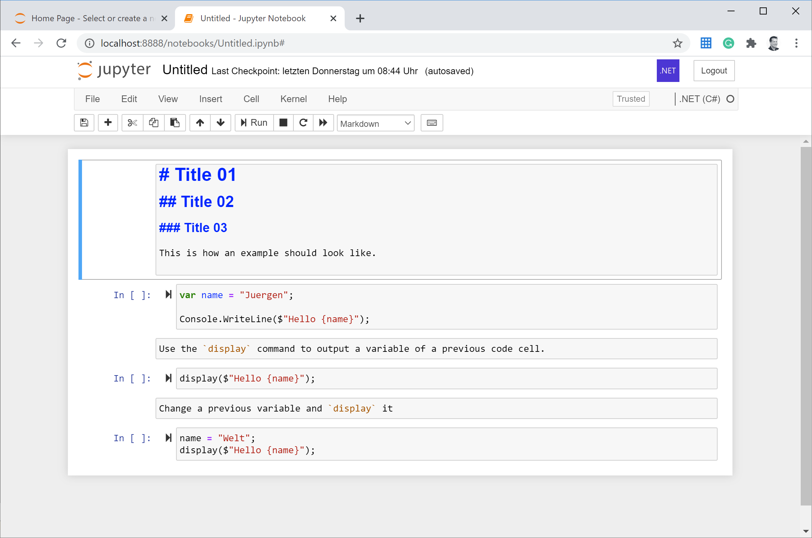
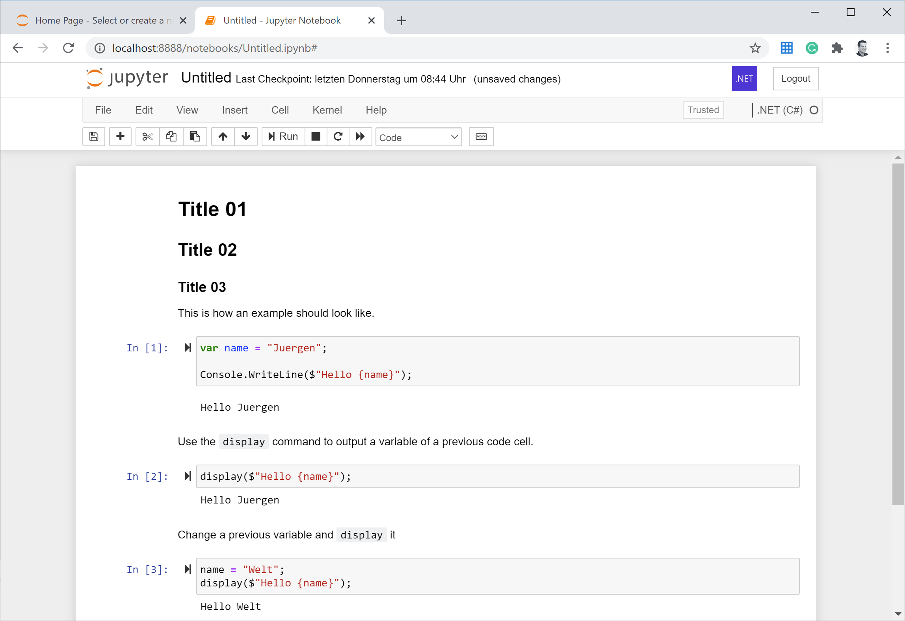
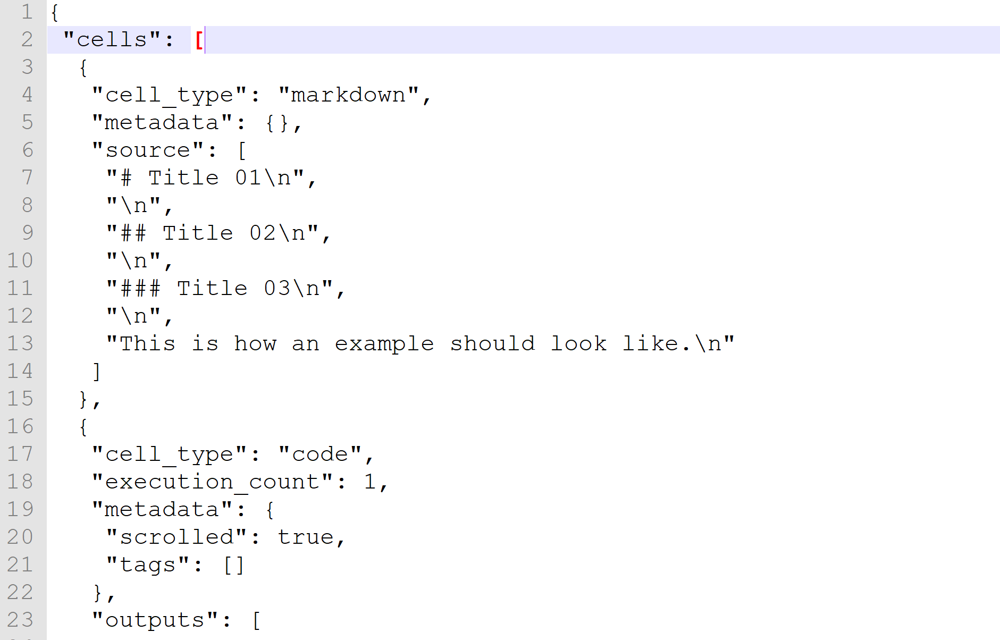

Since almost a year I do a lot of Python projects. Actually Python isn't that bad. Python and Flask to build web applications work almost similar to NodeJS and ExpressJS. Similarly to NodeJS, Python development is really great using Visual Studio Code. 

People who are used to use Python know Jupyter Notebooks to create interactive documentations. Interactive documentation means that the code snippets are executable and that you can use Python code to draw charts or to calculate and display data.

If I got it right, Jupyter Notebook was IPython in the past. Now Jupyter Notebook is a standalone project and the IPython project focuses on Python Interactive and Python kernels for Jupyter Notebook. 

The so called kernels extend Jupyter Notebook to execute a specific language. The Python kernel is default. You are able to install a lot more kernels. There are kernels for NodeJS and more.

Microsoft is also working on .NET Interactive and kernels for Jupyter Notebook.  You are now able to write interactive documentations in Jupyter Notebook using C#, F# and PowerShell.

In this blog post I'll try to show you how to install and to use it.

## Install Jupyter Notebook 

You need to have Python3 installed on your machine. The best way to install Python on Windows is to use [Chocolatey](https://chocolatey.org/packages/python/3.8.4):

```shell
choco install python
```

> Actually I use [Chocolatey](https://chocolatey.org/) since many years as a Windows package manager and never had any problems.

Alternatively you could [download and install Pythion 3 directly](https://www.python.org/downloads/) or by [using the Anaconda installer](https://www.anaconda.com/products/individual).

If Python is installed you can install Jupyter Notebook using the Python package manager PIP:

```shell
pip install notebook
```

You now can use Jupyter by just type `jupyter notebook` in the console. This would start the Notebook with the default Python3 kernel. The following command shows the installed kernels:

```shell
jupyter kernelspec list
```
We'll see the `python3` kernel in the console output:


## Install .NET Interactive

The goal is to have the .NET Interactive kernels running in Jupyter. To get this done you first need to install the latest build of .NET Interactive from [MyGet](https://myget.org/):

```shell
dotnet tool install -g --add-source "https://dotnet.myget.org/F/dotnet-try/api/v3/index.json" Microsoft.dotnet-interactive
```

> Since NuGet is not the place to publish continuous integration build artifacts, Microsoft uses MyGet as well to publish previews, nightly builds, and continuous integration build artifacts.

Or install the latest stable version from NuGet:

```shell
dotnet tool install -g Microsoft.dotnet-interactive
```

If this is installed you can use `dotnet interactive` to install the kernels to Jupyter Notebooks

```shell
dotnet interactive jupyter install
```


Let's see, whether the kernels are installed or not:

```
jupyter kernelspec list
```


That's it. We now have four different kernels installed.

## Run Jupyter Notebook

Let's run Jupyter by calling the next command. Be sure to navigate into a folder where your notebooks are or where you want to save your notebooks:

```shell
cd \git\hub\dotnet-notebook
jupyter notebook
```


It now starts a webserver that serves the notebooks from the current location and opens a Browser. The current folder will be the working folder for the currently running Jupyter instance. I don't have any files in that folder yet. 

Here we have the Python3 and the three new .NET notebook types available:


I now want to start playing around with a C# notebook. So I create a new .NET (C#) notebook:

## Try .NET Interactive

Let's add some content and a code snippet. At first I added a Markdown cell. 

The so called "cells" are content elements the support specific content types. A Markdown cell is one type as well as a Code cell. The later executes a code snippet and shows the output underneath:


That is a easy one. Now let's play with variables usage. I placed two more code cells and some small markdown cells below:

 

And re-run the entire notebook:

 

As well as in Python notebooks the variables are used in the entire notebook and not only in the single code cell. 

## What else?

Inside a .NET Interactive notebook you can do the same stuff as in a regular code file. You are able to connect to a database, to Azure or just open a file locally on your machine. You can import namespaces as well as reference NuGet packages:

```
#r "nuget:NodaTime,2.4.8"
#r "nuget:Octokit,0.47.0"

using Octokit;
using NodaTime;
using NodaTime.Extensions;
using XPlot.Plotly;
```

### VS Code

VS Code is supporting Jupyter Notebooks using [Microsoft's Python Add-In](https://marketplace.visualstudio.com/items?itemName=ms-python.python): 


Actually it needs a couple of seconds until the Jupyter server is started. If it is up and running, it works like charm in VS Code. I prefer VS Code over the browser interface.

### GitHub

If you use a notepad to open a notebook file, you will see that it is a JSON file that also contains the outputs of the code cells:



Because of that, I was really surprised that GitHub supports Jupyter Notebooks as well and displays it in a human readable format including the outputs:


The rendering is limited but good enough to read the document

## Conclusion

